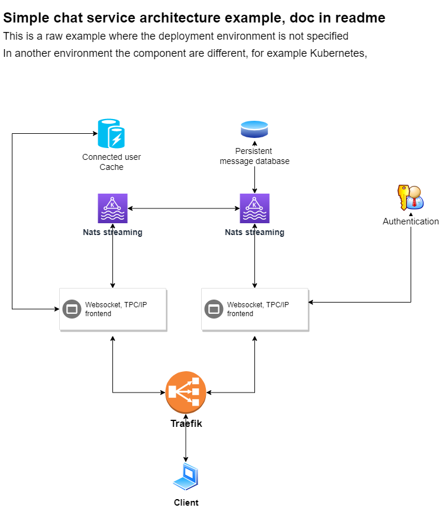

# Chat client and server example

----

This example implement simple tcp based message broadcaster server and client.  
The server using simple connection pool instead of create go routine for every new connection,
Better option for put every connection into new go routine

## Additional files

---
### Makefile

Example makefile added

### Docker

Example Dockerfile and docker build file added

### Systemd

Example systemd init script added

---

### Chat backend example workflow

---

Docs folder ChatBackend.png

* client connected to the frontend over load balancer
* frontend
  * authenticate the user
  * check the user multiple connection with user cache
  * store user connection information into the cache (current frontend id, connection id, etc)

#### Sending the message
* client send a message
* frontend send a message to the specified user
  * if the target is online, frontend send a notification to the target user directly - new message arrived
  * target online client query the available messages

#### Receive a message
* client receive new message when notification arrived or just query the available messages anytime
* frontend query the client messages from the specified channel
* frontend sending the messages to the client